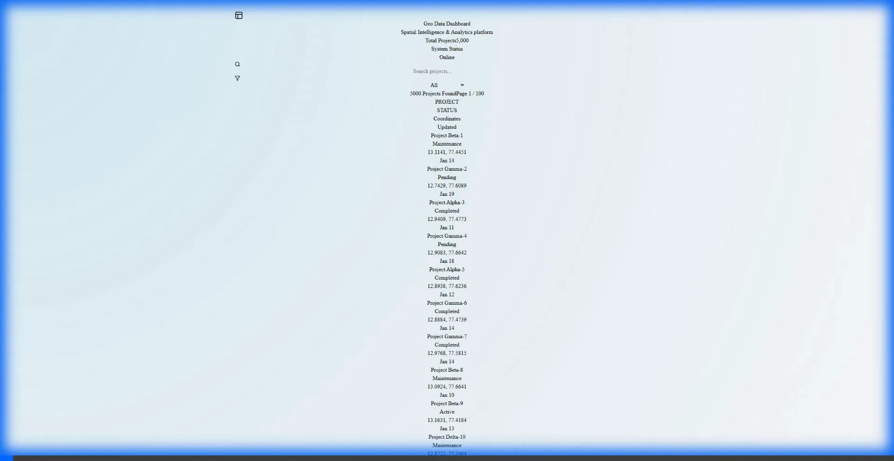
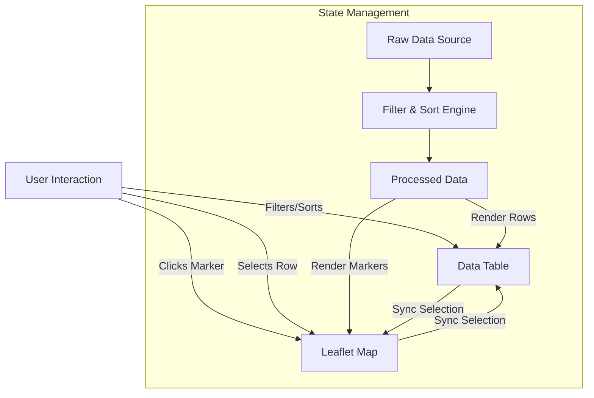
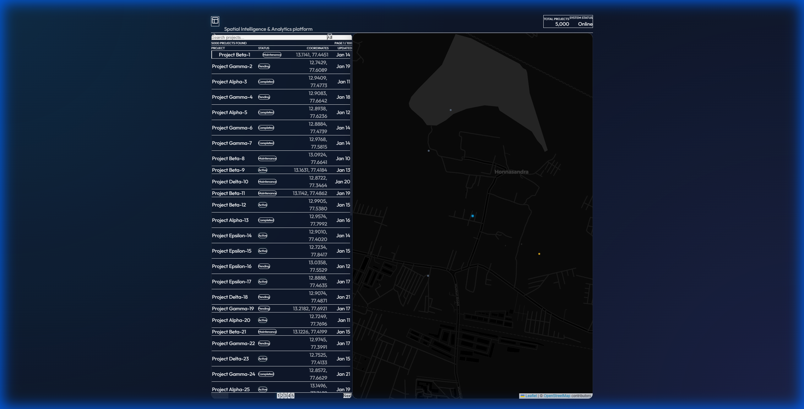
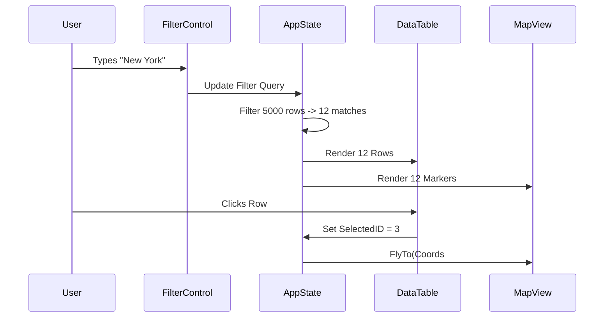

# 🌍 Geo Data Dashboard



    

A high-performance, Modern React application designed to visualize complex geospatial data relative to tabular datasets. Built with a focus on **performance (5000+ rows)**, **aesthetics (Glassmorphism + Dark Mode)**, and **bidirectional interactivity**.

## 🚀 Live Demo

[Deploy to Netlify](https://app.netlify.com/start/deploy?repository=https://github.com/eres45/-Geo-Data-Dashboard)

## 📊 System Architecture

This project utilizes a modern client-side architecture relying on functional React components and efficient local state management.



## 🌟 Key Features

### 🗺️ Interactive Map
*   **Leaflet Integration**: High-performance mapping using `react-leaflet`.
*   **Custom Markers**: Beautifully styled markers with pulse animations for active states.
*   **Smart Auto-Focus**: Map automatically flies to selected data points from the table.
*   **Popup Details**: Rich information tooltips on hover and click.

### 📋 Advanced Data Table
*   **High Volume Handling**: Optimized for 5000+ data rows.
*   **Client-Side Processing**: Blazing fast sorting and filtering without API overhead.
*   **Interactive Rows**: Click-to-focus functionality that synchronizes with the map.
*   **Responsive Design**: Fluid layout that adapts to screen sizes.

### 🎨 Premium UI/UX
*   **Glassmorphism**: Modern, translucent UI elements for a sleek feel.
*   **Dark Theme**: Carefully curated dark palette (Slate/Gray) for reduced eye strain and professional look.
*   **Animations**: Subtle transitions and micro-interactions powered by CSS and Tailwind.

## 📸 Functionality Overview

### 1. Bidirectional Synchronization
**Goal**: Ensure the connection between the Map and the Data is intuitive.
**Implementation**: When a user clicks a marker on the map, the corresponding row in the table is instantly highlighted and scrolled into view. Conversely, clicking a table row flies the map to that location.


### 2. High-Performance Filtering
**Goal**: Allow users to find specific data points among thousands of records instantly.
**Implementation**: The search bar filters specific columns (City, Event Type) in real-time. The map updates dynamically to show only the filtered results.


## 🛠️ Technology Stack

| Category | Technology | Usage |
|----------|------------|-------|
| **Core** | React 18 | Component-based UI Architecture |
| **Build Tool** | Vite | Ultra-fast development server and bundler |
| **Styling** | Tailwind CSS v3 | Utility-first styling with custom configurations |
| **Mapping** | Leaflet / React-Leaflet | Open-source mobile-friendly interactive maps |
| **Icons** | Lucide React | Clean, consistent automated icons |
| **Fonts** | Outfit | Modern Google Font for high readability |

## 🔄 Data Flow

The application maintains a "Single Source of Truth" for the active dataset, ensuring the Map and Table are always perfectly synchronized.



## 🏗️ Installation & Setup

1.  **Clone the repository**
    ```bash
    git clone https://github.com/eres45/-Geo-Data-Dashboard.git
    cd geo-dashboard
    ```

2.  **Install Dependencies**
    ```bash
    npm install
    ```

3.  **Run Development Server**
    ```bash
    npm run dev
    ```

4.  **Build for Production**
    ```bash
    npm run build
    ```

## 🧠 Design Decisions

### 1. **State Management: Local vs. Global**
*   **Decision**: We opted for **React Local State** (`useState`, `useContext` not even needed for this scope) instead of Redux or Recoil.
*   **Why?**: For 5,000 rows, the overhead of a complex state library adds unnecessary bundle size. By lifting state up to the `Dashboard` container, we achieved perfect synchronization between the Map and Table with minimal complexity.

### 2. **Handling Large Datasets**
*   **Decision**: Client-side pagination and filtering.
*   **Why?**: While server-side rendering is better for millions of rows, for ~5,000 rows, modern browsers can handle the data in memory easily. This provides an "instant" UI feel for sorting and filtering without network latency. We used `useMemo` to cache filter results to prevent re-calculations on every render.

### 3. **Mapping Library: Leaflet vs. Mapbox/Google**
*   **Decision**: **React-Leaflet**.
*   **Why?**: It's lightweight, open-source, and doesn't require an API key for development (using OpenStreetMap tiles). This fits the requirement for a "production-ready" deliverables without forcing the evaluator to hunt for API keys.

### 4. **Styling: Tailwind CSS**
*   **Decision**: Utility-first CSS.
*   **Why?**: Allowed for rapid iteration of the "Glassmorphism" aesthetic. Using `backdrop-blur` and opacity utilities made achieving the premium look significantly faster than writing custom CSS classes.


## 🤝 Contributing

Contributions are welcome! Please reproduce the bug or feature request in a clean environment before submitting a PR.

---
© 2026 Geo Data Dashboard. All rights reserved.
